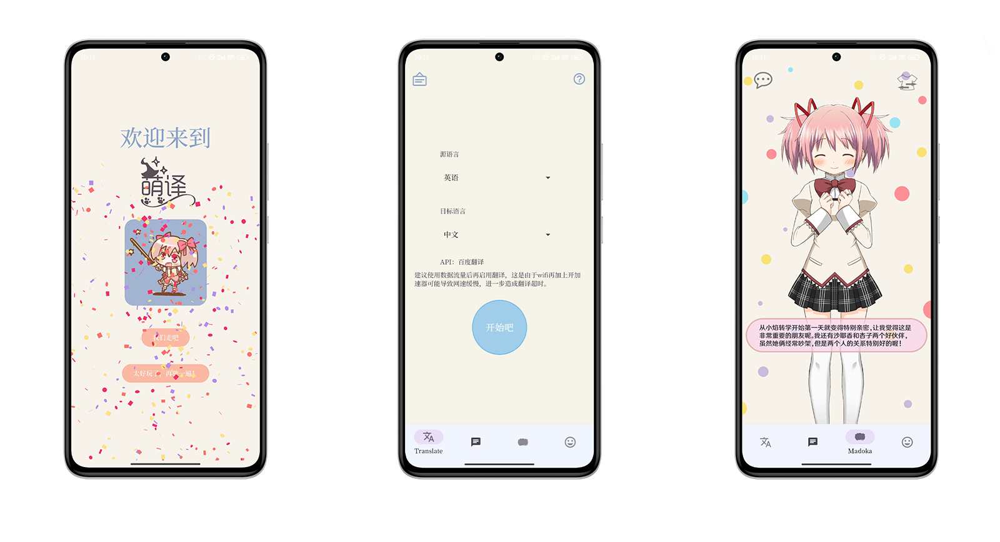

<h1 align="center">萌译MoeTranslate</h1>
一键翻译图片文字内容，让您和非中文游戏的距离不再遥远；不仅如此，还支持Gemini聊天和Live2D。

更多内容点击下面的“文档说明”。

[![Web][Web-image]][web-url]
[![Github][Github-image]][github-url]
[![Document][Document-image]][document-url]

[web-url]: https://moetranslate.top
[Web-image]: https://img.shields.io/badge/%E7%BD%91%E7%AB%99-%E5%AE%98%E7%BD%91-red?logo=Android&logoColor=green
[Github-image]: https://img.shields.io/badge/Github-Release-blue?logo=Github
[github-url]: https://github.com/murangogo/MoeTranslate/releases
[Document-image]: https://img.shields.io/badge/%E6%96%87%E6%A1%A3-%E8%AF%B4%E6%98%8E-purple?logo=adobeacrobatreader
[document-url]: http://file.moetranslate.top/s/aKSG

