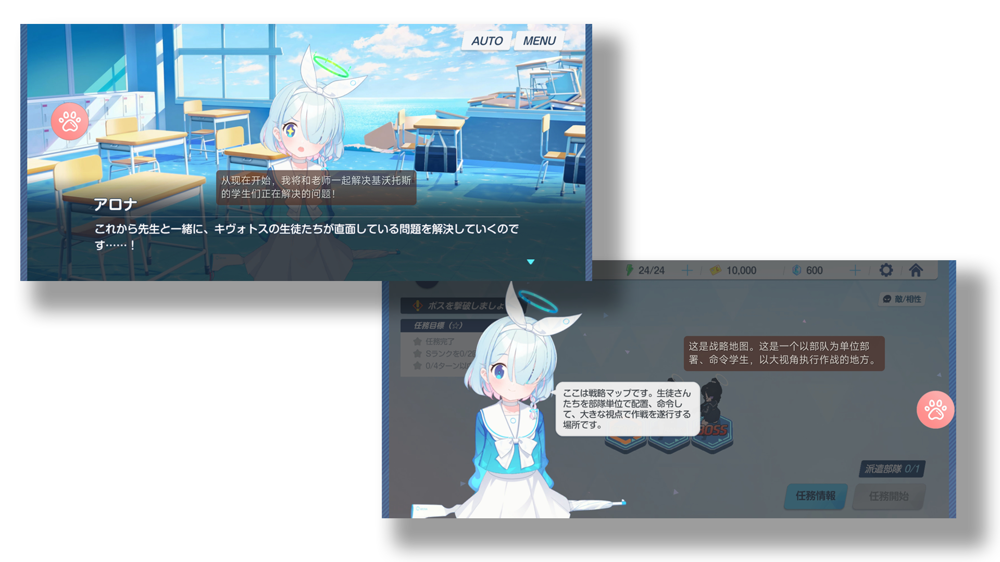
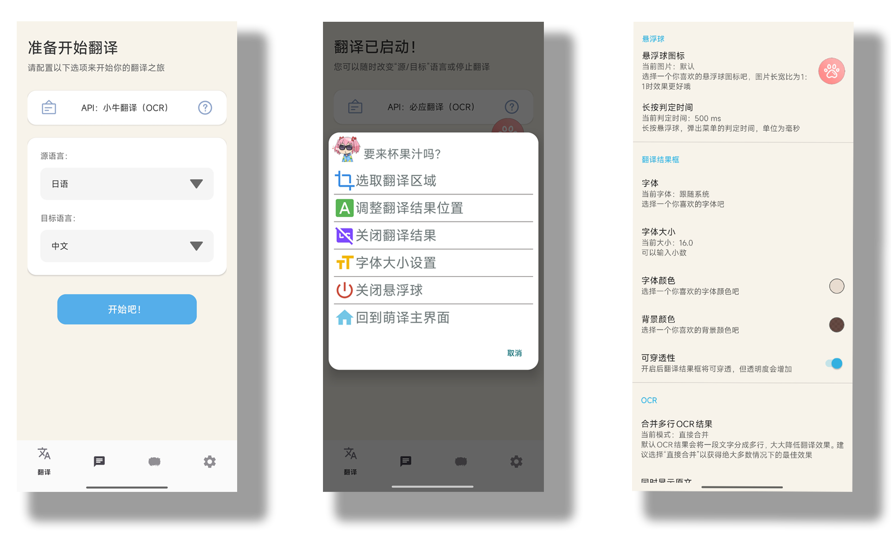
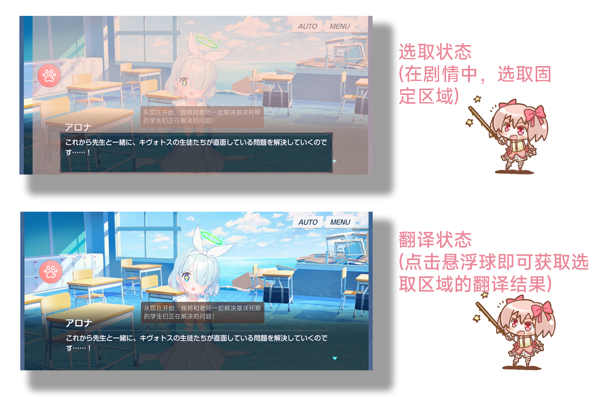
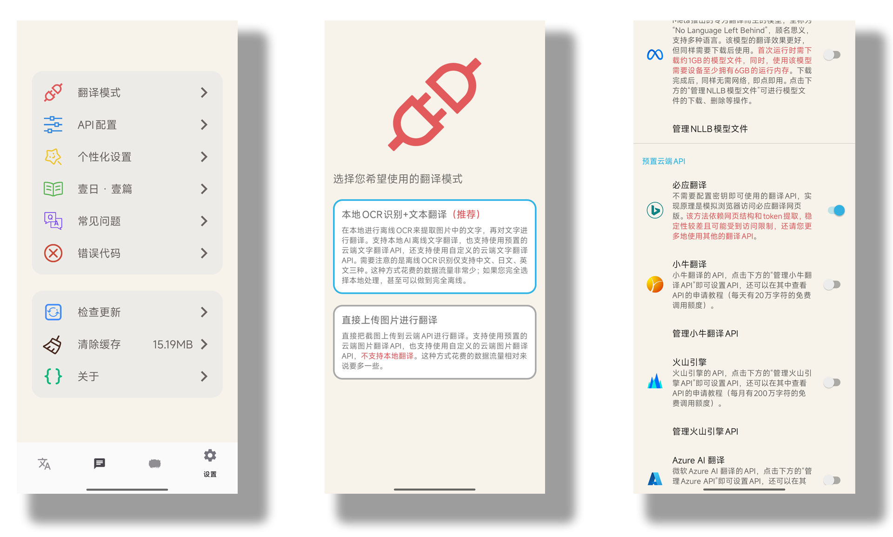
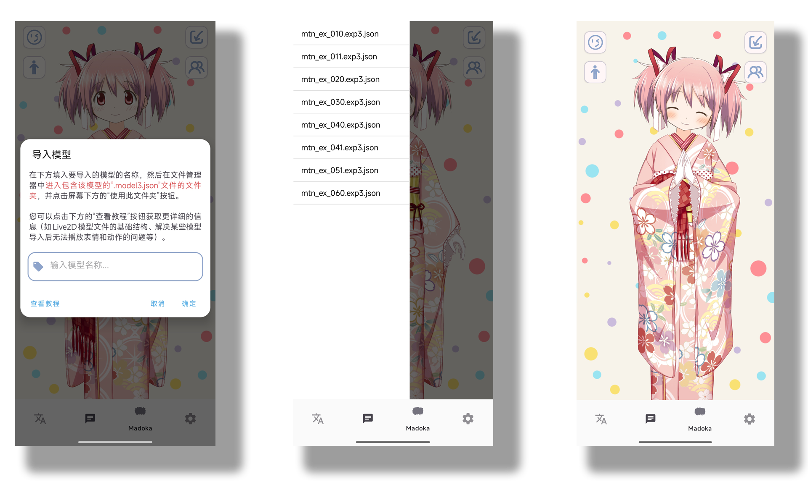
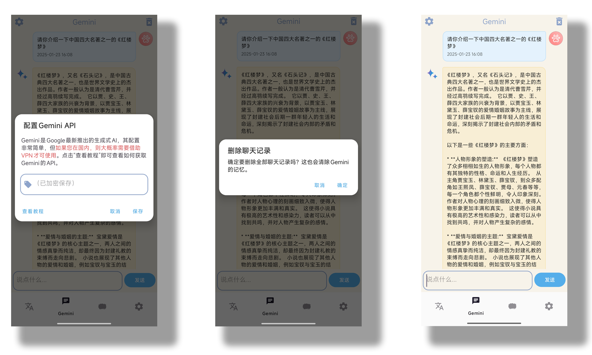

# 萌译MoeTranslate

一键翻译图片文字内容，让您和非中文游戏的距离不再遥远；不仅如此，还支持Gemini聊天和Live2D。

更多内容请查看下方的官网。

[![Web](https://img.shields.io/badge/%E7%BD%91%E7%AB%99-%E5%AE%98%E7%BD%91-red?logo=data:image/png;base64,iVBORw0KGgoAAAANSUhEUgAAACAAAAAgCAYAAABzenr0AAAHIUlEQVRYR8VXCYwTVRh+/3vTLeCy250e2xXEAw+UiKAGMd4az8RIPHCXdgt4REWjKN63eHDEgJKgUVCk211lFQ2aaJQoRglHQKOCEryCsmy7s+20gsuy3c77/d+U1h57aWKcpM3MvPf/7/u//xxg//MF/+R8b4t5NkjZwBk7g0nuZVx6bXnJO+nPkJxtYRY0GzPcm4aqd3AAK3FYnSN1KzKcg4hHDkkxwK8S5JLOGvdydgX0DCQzIIDaN5M3QMaajwx8thKA7QzxZPuWwVsEqt6+R1iNgNeX7iHAMY3zue1BvaU/EP0C8EXMRYB4nxJEZHs1xJkZwS6mw+5HxtYYje5ra5sSdMtYR1Dn/khiLQG9knHxnATrS5BsOSAbrdY54mPRkOeZvkCUA0AEX7O5koRn5AQcABNktRbNJDPtHGR6WEaM3j2rJpUH0OiGwz/Y55HJ9B5FyDBL+P+sgLFCWttyOjiwpdGg+65SEGUAfE3xl4je2xDgDyZlNwD4HVw73mJ4gZTWK0T1IiPoeUApKgSgnn2R+DJiaDbT+I0Zh9iodffuVG5gnA8nNqvJqHmxkPuJQhBFAOrCybspeBYDYDdKdgEw7TwEayE9byV6CQObojm0M/fWV2/uC4C/KXk+MrmeIWxCLp0E5lSO/B4L5WYu8FMidzhyCBoBvTkHIg/gqJVJ1wFh/U4WjxQAATtwWnG4L51cR+jPyglIhDs0p2N7F1TuGN5jJtT7LqfuG9mTHJcRciK3YGleOeL6mMd9ucoEf3M8hBJWIbA2o0Ify6ZBOhvMhy5/c2IeWf0YHbY+FvJcmKfpFXT4R6QWk2V39BfJfb2XyF7oPEK/j3jM5NYpsDcoY0DA7bHp+kt/A6BDfIeZcfJRlQq4tqC+vVCpL5J8HFA+ReuvSw4JiupzJbAT1X5bCUCSUnIX/b7gEjxk5Q0c8NFo0PNsoR5iYTKxsIUEfqXMGZsH4I/8cTli5kMKvG+MoD6p1CJfOLEGgF3NOV4TDXjeza2XBqF6730zdS3PWG8TqNZYUM/WhoKrNmL+Qnl9jOZwTtxbX/mt7YLasPkqVZObJRcPdgZcC8sAROJfqYAqZacvAIevSk6yuPyaFG+JNbqnlOrKuRqBP2EEa+bZAHzh+NeEeBLn7LJowP1xmVDE3K3KsMOJo9umefYOxIBrTfeRzgMHdpM7fjYaPceVGdOSnAqWfI/Y/ojYviILIJLYo6qW0NiY9ga3KiZFF+X3fmKgkqFe2RGCroEA1LSa1RU9mFJxQS7QS3Ud8UZqbFpYP1Ot2RFr1E+2Afgj8QMqR0s3/5fPqtARA65DDByy8L88sUQ3uXS/EfJU5QD8SBQfV2GJY/fMdP1S7gIzpUqpq0pW7brKu38gF5ywtnNkah/fR4ymjJBeU6rL23rwWN7T9ROV9F1U0sdlXRCOf06UnCekY2r7jKq1pUK51CmNkb6yYLAgrGuOXy0lrAGGn8UaPRcdYiDbeqnALKC2+VBZFoQTW6i4TJZOPqlzWs03AzGQS0PqHRuNRj1fwnMy/nDyeQQ5lwPMjwb1h20AatTiFn5p1+mAPoYqld3n8wdFzBYqHg1SE9d1NrjeGQiAvykxjYRXk4+byMehImMQOa3HiG1vxqFNTtRXb832ArUQSUTV5INCXGJMd60rFKyLxB+hJvQMbV4pAeLZUgzjVFzY4hTRROlOLvFzi4Of4M8EFA/EQq5FRYaEzSup4L1PKfobpehRai3fjIiFB4mF+WT8V7Gg5/RCQUL9JFlV1McHSxhk/HGjsebp/D6KSmrX2yn4xpPBd3WEPHbX/BtAK1aKg8ndtMFNb+s7gu7V2XZsvlw4HUmBd2rC+S2MwB+sVC9Nw4wJl8Ob3g/jgfVMKG7H7PWYR5+t2nFtOHUjjRQrSH/U0N1H54bVooHE32LORguXEZ1djLML6eCLbeoRt0nGDxI7ZwuHuLS93vWJOrg0C7wticu4xT4iYzfQyD7CHkgYnwOa3Cp7aSABGMa5FooGqptyzJSNZN5wYgnNb3NI2GQgM/ZEjCOOEZCeYrFMi5qAYyHdnobLRrKmxDuk8Br6XZ92Vuxw9KS/VwMt41Cp4gU5f9II1DxV6L4+h1J/xHyNfD4rt1FIfmq7dO30i2QbfXzoFSBOaAtU/1QIwN+SGI8W20EHdca63aNGVXedlOntyacsMfpiR8A9pzR2hjSWq6jllrypV9NO49JakJuaisdycxOBPoNS+V7k7Huag1bQDDHKDrQ+MqJfFxSljfow6bUWqLzNpit8R9omZPcgDZYQsO/oO0FRn70HGjLwlOx21saRzaW5oLW/rBnSp5nXmbhZZPi9FMFjBks/+2DEH8EhFnbsczWxW6B3IJnBAeSkKbTrWv88h6XTIQIysejjlHGDBpColGyz5hDN0QZX/oNkMMBDBzCYpn+5/hfKVJpOIq6p8QAAAABJRU5ErkJggg==)](https://www.moetranslate.top)

## 简介

萌译是一款安卓端的翻译软件，基于Android 11+的无障碍截图权限开发。

支持两种模式：

- **本地OCR识别+文本翻译：** 通过ML Kit实现**本地**OCR识别（支持的源语言有中文、日文、英文），然后将识别到的文字使用特定API进行翻译，获取翻译结果。
  
- **直接上传图片进行翻译：** 将截图直接上传给特定API，获取翻译结果，适用于源语言不是中文、日文、英文的情况。

## 一、翻译功能

翻译是萌译的核心功能，对于上述两种模式，分别支持不同的API，每个API的申请方法在[萌译官网](https://www.moetranslate.top/)中都有详细的教程（视频教程、图文教程）。

除此之外，您还可以**自定义API接口**来进行翻译，上述两种模式均支持自定义API接口，也就是说，**您可以在局域网内的电脑上搭建您喜欢的翻译服务（如：对接GPT、搭建Sakura本地翻译模型），然后通过萌译在手机上享受这些服务带来的便利**。这种方法需要您掌握一定的编程知识和计算机网络知识，在萌译官网上有一些简易的[搭建教程](https://www.moetranslate.top/docs/translationapi/customtext/)。

### 1、使用方法

简易的使用方法介绍如下图所示，更详细的使用方法在您初次使用App时会有详细的介绍。

### 2、预置API介绍

- **本地OCR识别+文本翻译：** 这是比较推荐的一种翻译方式，预置支持的API有：

> **ML Kit翻译：** 属于本地AI翻译。除了第一次使用需下载模型（约100MB）外，其余时间可离线使用。搭配本地OCR识别，可实现全程离线翻译。值得注意的是，由于该模型体积很小，因此翻译质量较低，适合特殊情况下使用。
翻译质量：★（1星）

> **NLLB翻译：** 属于本地AI翻译。除了第一次使用需下载模型（约1GB）外，其余时间可离线使用。搭配本地OCR识别，可实现全程离线翻译。该模型相较于前者，翻译质量有所提升，支持的目标语言也更多，但受限于手机端算力，翻译质量相较于在线API差距仍然很大。
 翻译质量：★★（2星）

> **必应翻译：** 属于在线翻译API。这是唯一一个不需要提前配置API Key即可使用的在线翻译方式。其实现原理是通过模拟浏览器访问网页的行为来实现翻译，依赖于网页结构和token提取，这是非常不规范的行为，稳定性较差。也正因为如此，萌译无法保证它随时可用。该方法翻译质量尚可，不过由于它实现方式的特殊性，还是适合特殊情况下使用。
翻译质量：★★★★（4星）

> **小牛翻译：** 属于在线翻译API。需要提前配置API Key方可使用。注册后即可享受**每天20万字符的免费调用额度**，一般用户足够使用。API申请方法也非常简单，翻译质量很高，综合考虑的不二之选。
[申请教程](https://www.moetranslate.top/docs/translationapi/niutrans/)
翻译质量：★★★★★（5星）

> **火山引擎：** 属于在线翻译API。需要提前配置API Key方可使用。这是字节跳动旗下的翻译API，注册后即可享受**每月200万字符的免费调用额度**，一般用户足够使用。API申请方法相比小牛翻译要复杂一些，翻译质量较高。
[申请教程](https://www.moetranslate.top/docs/translationapi/volc/)
翻译质量：★★★★✬（4.5星）

> **Azure AI 翻译：** 属于在线翻译API。需要提前配置API Key方可使用。这是微软旗下的翻译API，实际上就是必应翻译的API版，注册后即可享受**每月200万字符的免费调用额度**，一般用户足够使用。API申请方法比较复杂，翻译质量尚可。
[申请教程](https://www.moetranslate.top/docs/translationapi/azure/)
翻译质量：★★★★（4星）

> **百度翻译：** 属于在线翻译API。需要提前配置API Key方可使用。注册后即可享受**每月100万字符的免费调用额度**，一般用户足够使用。API申请方法比较简单，翻译质量一般。
[申请教程](https://www.moetranslate.top/docs/translationapi/baidu/)
翻译质量：★★★✬（3.5星）

> **腾讯云：** 属于在线翻译API。需要提前配置API Key方可使用。注册后即可享受**每月500万字符的免费调用额度**，免费额度很大。API申请方法稍微复杂一些，翻译质量很一般。
[申请教程](https://www.moetranslate.top/docs/translationapi/tencent/)
翻译质量：★★★（3星）

- **直接上传图片进行翻译：** 直接把截图上传给设定的API来翻译，预置支持的API有：

> **百度翻译：** 属于在线翻译API。需要提前配置API Key方可使用。注册后即可享受**每月1万次的图片翻译免费调用次数**，一般用户足够使用。API申请方法比较简单，和上面的文字翻译相比，带来的质量提升主要在OCR的精准度上。
[申请教程](https://www.moetranslate.top/docs/translationapi/baidu/)
翻译质量：★★★★（4星）

> **腾讯云：** 属于在线翻译API。需要提前配置API Key方可使用。注册后即可享受**每月1万次的图片翻译免费调用次数**，一般用户足够使用。API申请方法稍微复杂一些，由于腾讯云的图片翻译仅支持单行翻译，因此当一句话多于一行时，会造成翻译严重不正确的情况。
[申请教程](https://www.moetranslate.top/docs/translationapi/tencent/)
翻译质量：★★（2星）

## 二、其他功能

### 1、Live 2D模型查看

得益于[Live 2D的SDK](https://www.live2d.com/sdk/about/)，萌译支持导入Live 2D模型，并自动解析模型附带的动作和表情，然后用户可选择特定的动作和表情播放，实现随时随地欣赏Live 2D角色。

具体的教程可[点击此处](https://www.moetranslate.top/docs/live2d/importmodel/)查看。

\*图中的鹿目圆模型来自魔法纪录，在此仅作为预置模型展示软件功能，版权归原作者所有。

### 2、Gemini AI聊天

Google的Gemini正处于全民公测阶段，而且实际上Gemini模型的实力不俗，刚好其[Gemini-1.5 Flash](https://ai.google.dev/pricing#1_5flash)的API有免费方案可以使用，因此我们可获取API后在萌译中和其进行聊天。值得注意的是中国大陆用户需开启VPN后使用。
